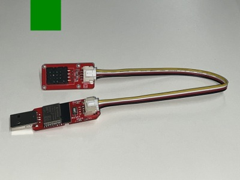

# Home_Garden_Advisor
当プロジェクトは、家庭菜園という限定的な気温を測定し、予測推移と合わせてAIが作物に合わせた助言を行い、家庭菜園初心者を助ける機器の開発というコンセプトです。
**ESP32**で取得したセンサーデータとAIによる予測と助言をLINE経由で行い、**Google Apps Script (GAS)**を介して**Googleスプレッドシート**に連日の気温・湿度情報を記録します。

---

## 使用技術

| 技術スタック | 詳細 |
| :--- | :--- |
| **ハードウェア** | ESP32-CherryIoT, DHT20 (温度・湿度・気圧センサー) （こちらは学習教材としてESP32CherryIoTの機器をお借りして使用しています。）|
| **ファームウェア** | Arduino |
| **クラウド** | Google Apps Script, Google スプレッドシート |
| **API** | OpenWeather, Google Gemini, Line |

---

## 動作原理

このプロジェクトの中核を担うGASスクリプトは、ESP32から送られてきた気温・湿度データをもとに、以下のような処理を自動実行します。

1.  **ESP32からのデータ受信**:
    - ESP32からGETリクエストで気温・湿度データを受け取ります。

2.  **外部API連携**:
    - 受信した測定値をもとに、OpenWeather APIから12時間分の地点予測気温データを取得します。
    - 測定値、予測気温、そして育てている野菜の種類（例：ミニトマト、ナス）をGemini APIへのプロンプトにまとめ、庭限定の気温予測と作物への対処法を生成します。

3.  **情報発信**:
    - Gemini APIが生成したテキスト（例：「ミニトマトは夜間の冷え込みに注意が必要です...」）をLINEで送信します。

4.  **データ記録**:
    - ESP32からの測定値、OpenWeatherの予測値、そしてGeminiが生成したテキストをGoogleスプレッドシートに記録します。

### 概念図
<table>
  <tr>
    <td align="center">
      <figure>
        
      </figure>
    </td>
  </tr>
</table>

---

## セットアップ手順

### 1. ハードウェアの準備

[使用するセンサーや部品のリスト、および配線図へのパス]

### 2. Google Apps Script の設定

1.  **スプレッドシートの準備**:
    * [GAS_scripts/scensorData.ods](GAS_scripts/censorData.ods) をダウンロードし、Googleドライブにアップロードしてください。
    * スプレッドシートを開き、URLから**スプレッドシートID**を控えておきます。

2.  **GASのデプロイ**:
    * 開いたスプレッドシートから[AppScript](images/spreadsheet_setting.png)を開きます。
    * 新規のスクリプトファイルを作成し、デフォルトの記述を削除します。
    * `gas_scripts`フォルダ内の`.gs`ファイルを開き、書かれたコードをコピーペーストで張り付けてください。gsファイルは全7つですが、同じように7つに分けても、一つのgsファイルに7つ分すべてのコードをコピーしても機能するはずです。
    * 全ての.gsファイルのコードを移し終えたら、Webアプリとしてデプロイし、発行されたURLをコピーします。

3.  **APIキーの設定**:
    * GASの「プロジェクトの設定」から「スクリプトプロパティ」を開きます。
    * **キー**に 画像にある[キー名](images/APIkey_list.png)を、**値**にご自身の持っているAPIキー/スプレッドシートIDを設定してください。

### 3. ESP32 ファームウェアの設定

1.  **プロジェクトを開く**: `ESP32_cherryIoT/`フォルダ内の `.ino`ファイルをArduino IDEで開きます。
2.  **Wi-Fi設定**: コード内の `const char* ssid = "****"` と `const char* password = "****"` をご自身のWi-Fi情報に書き換えます。
3.  **GASのURL設定**: 先ほど取得したGASのWebアプリURLをコード内の該当箇所に貼り付けます。
4.  **書き込み**: Arduino IDEで**ESP32 C3 Dev Module**ボードを選択し、PCとESP32を接続して書き込みを実行します。

---

##  実機画像

<table>
  <tr>
    <td align="center">
      <figure>
        <figcaption align="center">
          <code>本体</code>
        </figcaption>
        
      </figure>
    </td>
    <td align="center">
      <figure>
        <figcaption align="center">
          <code>送信メッセージ</code>
        </figcaption>
        
      </figure>
    </td>
  </tr>
</table>

---

## 経緯

この機器はIoT初学者が技術的な理解・練習のために作成しました。

